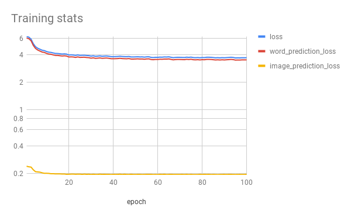

# LT2316 H18 Assignment 3

Git project for implementing assignment 3 in [Asad Sayeed's](https://asayeed.github.io) machine learning class in the University of Gothenburg's Masters
of Language Technology programme.

## Group members

Florian Stellbrink

## Your notes

This time I haven't added any unusual dependencies. Just matplotlib, keras, and sklearn.  
Please use `python3.6`

### Running `train.py`

This script expects three arguments.
- The path to the pretrained autoenocder, e.g. /scratch/gusstefl/pre_project/vanilla/model.h5
- Folder for checkpoints, e.g. /scratch/gusstefl/a3
- Output model file, e.g. /scratch/gusstefl/a3/model.h5

Example: `python3.6 train.py /scratch/gusstefl/pre_project/vanilla/model.h5 /scratch/gusstefl/a3 /scratch/gusstefl/a3/model.h5`

### Running `prediction.py`

In addition to the usage specified in `HowToRun.py` you can call `sentence_prediction` with the same parameter as `predictive_search`.

This will predict the most likely five next words following the input. (*NOT* the five words that are most likely to appear int the next position like `predictive_search`!)  
It will show likely images before and after predicting those five words.

See `HowToRun.ipynb` for an example usage.

### Architecture

The model simply feeds the tokenized input through an embedding layer into a single lstm layer.
From there two dense layers produce predictions for the next word and encoded image.

The image encoding uses and `absolute_loss` objective like assignment 2.  
The word prediciton uses `categorical_crossentropy`.

The model uses a batch size of 32 and has been trained over the training part of the COCOS image set for 100 epochs, using the `adam` optimizer.

The loss functions improved very slowly after a few epochs, as you can see in the following chart:

This is probably due to the very minimalistic architecture.

### Results

The most likely next words for the sentence 'a toilet standing' were: 'a', 'the', 'an', "it's", 'male'.  
The predicted image was actually of a toilet. (/scratch/lt2316-h18-resources/coco/val2017/000000267903.jpg)

Sentence prediction generated the following sentence:
'The man is a through of a to' where the input was 'The man is'.

### Reflection

Word prediction tends to produces only the most common words. Common words like 'a', 'the', and 'it' are safe guesses but do not produce convincing sentences.
Obviously the classes are very inbalanced and it might be interesting to see how balancing the word classes can change this result.

Learning stagnated very early. More layers and more lstm cells might enable the network to learn more complex connections between and within sentences and images.